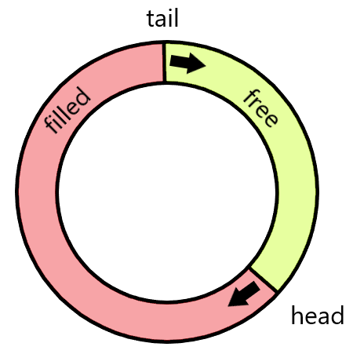
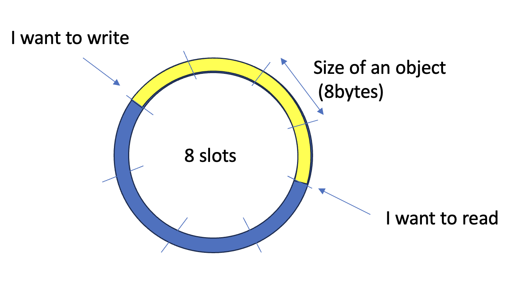

#FastQueue2

FastQueue2 is a rewrite of [FastQueue](https://github.com/andersc/fastqueue). 

##Background

When I was playing around with benchmarking various SPSC queues deaod’s queue was unbeatable. The titans: Rigtorp, Folly, moodycamel and boost where all left in the dust, it was especially fast on Apple silicone. My previous attempt is placing itself in the top tier. I also implemented a stop-queue mechanism missing from the other implementations. Anyhow….

So I took a new egoistic approach, and looked if there were any fundamental changes to the system that could be made. I’m only working with 64-bit CPU’s so let’s only target x86_64 and Arm64. Also for all my cases I pass pointers around so limiting the object to a 8 byte object is fine.

In the normal SPSC queue there is a circular buffer where push is looking if it’s possible to push an object by looking at the distance between the read and write pointer/counter. The same goes for popping an object, if there is a distance between read and write there is at least one object to pop. That means that if the push runs on one CPU and the pop runs on another CPU you share write/read and the object itself between the CPU’s. 



*The above picture is taken from Deaods repo*

I concluded based on the above limitations it’s possible to share the queue position by looking at the object itself (I’m aware that this is probably not something revolutionary. Most likely someone at Xerox PARC wrote a paper about this in the 70’s). That means that the CPU’s do not need to share its counters it only need to share the object, and it wants to share that object anyway. So it’s the absolute minimal amount of data. 
However for this to work without pointers/counters the object must be there or not. So when we pop the object in the reader thread then we also need to clear it’s position in the circular buffer by assigning a nullptr.



So the concept is exactly the same as before it’s just that we now know where we wrote an object last time now we just check if it’s possible to write an object in the next position before actually committing to doing that. So if the tail hits the head we will not write any objects, and if the head hit’s the tail there are no objects to pop.

Using that mechanism we only need to share the actual object between the threads/cpus.

##The need for speed

* So what speed do we get on my M1 Pro?

```
DeaodSPSC pointer test started.
DeaodSPSC pointer test ended.
DeaodSPSC Transactions -> 12389023/s
FastQueue pointer test started.
FastQueue pointer test ended.
FastQueue Transactions -> 17516515/s
```

And that’s a significant improvement over my previous attempt that was at around 10+M transactions per second while Deaod is at 12M.

What sparked me initially was the total dominance by Deaod on Apple Silicone now that’s a check.. Yes! in my application the way the compiler compiles the code I by faaar beat Deaod. 

* What about x86_64?  

I don’t have access to a lot of x86 systems but I ran the code on a 64 core AMD EPYC 7763. I had to slightly modify the code to beat Deaod.

```
DeaodSPSC pointer test started.
DeaodSPSC pointer test ended.
DeaodSPSC Transactions -> 12397808/s
FastQueue pointer test started.
FastQueue pointer test ended.
FastQueue Transactions -> 13755427/s
```

So great! Still champagne, but did not totally run over the competition. 10% faster so still significant. 

The CPP file is under 60 lines and uses a combination of atomics and memory barriers to what I found the most optimal combination.

Push looks like this:

```cpp
while(mRingBuffer[mWritePosition&RING_BUFFER_SIZE].mObj != nullptr) if (mExitThreadSemaphore) [[unlikely]] return;
new(&mRingBuffer[mWritePosition++&RING_BUFFER_SIZE].mObj) T{std::forward<Args>(args)...};
```
Simple. Is the slot free? if not is the queue still operating?
If it's OK to push the object just put it in the queue.

Pop looks like this:

```cpp
std::atomic_thread_fence(std::memory_order_consume);
while (!(aOut = mRingBuffer[mReadPosition & RING_BUFFER_SIZE].mObj)) {
    if (mExitThread == mReadPosition) [[unlikely]] {
        aOut = nullptr;
        return;
    }
}
mRingBuffer[mReadPosition++ & RING_BUFFER_SIZE].mObj = nullptr;
```
Try popping the object. If sucessfull mark it free.
If not sucessfull popping the object is the queue active?
if it's not then just return nullptr


Regarding inline, noexcept and [[unlikely]].. It's there. Yes I know -O3 always inlines and I have read what people say about [[unlikely]].
If you don't like it. remove and pullrequest.

##Usage

See the orignal fastqueue (the link above)

##Some thoughts
There are a couple of findings that puzzled me. 
1.	I had to increase the the spacing between the objects to two times the cache length for x86_64.
2.	Pre-loading the cache when popping (I did comment out the code but play around yourself) did do nothing. I guess modern CPU’s pre-load the data speculatively anyway.
3.	I got good speed when the ringbuffer size exceeded 1024 entries. Why? My guess is that it irons out the uneven behaviour between the producer consumer. It’s just that my queue there was a significant increase in efficiency while for Deaod I did not see that effect. Well. We’re on the verge on CPU hacks and black magic so well. 

Can this be beaten? Yes it can.. However the free version of me is as fast as this. The paid version of me is faster ;-).. I'm a demo-coder from the 90's so, yes MUCH FASTER!! 

Have fun 

Hook up on linkedin ‘Anders Cedronius’
