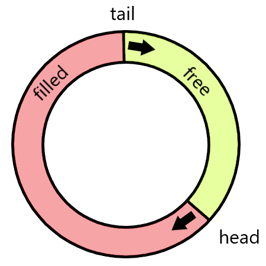
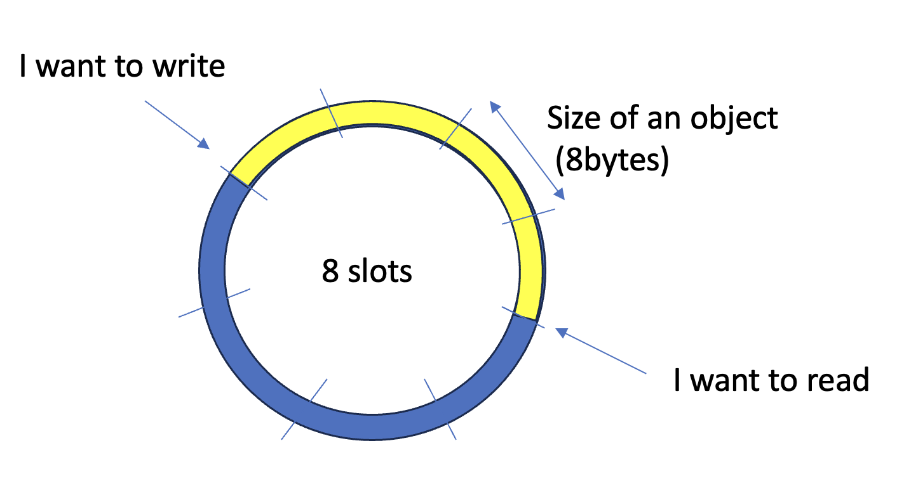

# FastQueue2

FastQueue2 is a rewrite of [FastQueue](https://github.com/andersc/fastqueue). It supports 8-byte transfers only.

## But first

* Is this queue memory efficient?

	No. This queue aims for speed, not memory efficiency.

* The queue is ‘dramatically under-synchronized’

	Write a test and prove it (you can use FastQueueIntegrityTest.cpp as a boilerplate). Don’t just say stuff out of the blue, prove it!

* Why not use partial specialization for pointers since that's all you support?

	This queue supports the transport of 8 bytes from a producer to a consumer. It might be a pointer and it might not be, so that’s why no specialization is implemented. However, if we gain speed by specializing for pointers, then let’s implement that. I did not see any gain in my tests, and this queue is all about speed.


## Background

When I was benchmarking SPSC queues, [deaod’s](https://github.com/Deaod/spsc_queue) and [Dro’s](https://github.com/drogalis/SPSC-Queue/tree/main) were strong baselines. [Rigtorp](https://github.com/rigtorp/SPSCQueue), [Folly](https://github.com/facebook/folly/tree/main), [moodycamel](https://github.com/cameron314/concurrentqueue), and [boost](https://www.boost.org/doc/libs/1_66_0/doc/html/lockfree.html) are other established implementations. My previous attempt ([FastQueue](https://github.com/andersc/fastqueue)) reached the top tier but did not lead every measured workload. It also implements `stopQueue`, which the comparison implementations do not all provide.

This project targets measured use cases rather than universal queue rankings: 64-bit x86_64 and arm64 CPUs, one producer, one consumer, and 8-byte transfers. Pointers are common payloads, but any 8-byte value fits.

In the general SPSC queue implementation there is a circular buffer where push checks whether it’s possible to push an object by looking at the distance between the tail and head pointer/counter. The same goes for popping an object: if there is a distance between tail and head, there is at least one object to pop. That means that if the push runs on one CPU and the pop runs on another CPU, you share the tail/head counters and the object itself between the CPUs.



*The above picture is taken from Deaod’s repo*

The first version of this queue used the object slot *itself* as the full/empty
flag: pop cleared the slot to `nullptr`, push waited for `nullptr`. Elegant, and
it means the CPUs only ever share the object. The problem only shows up when you
measure the *pure* queue (no per-message malloc masking it): that scheme bounces
a whole cache line **both** directions for every single element (producer
publishes the pointer → consumer reads it → consumer writes the `nullptr` back →
producer reads that back), so it moves an order of magnitude more coherence
traffic than a packed ring. Against a benchmark dominated by `new`/`delete` it
looked great; as a raw queue it was several times slower than the titans.



So this version keeps FastQueue API (`push`, `pop`, `stopQueue`, 8-byte objects)
and uses data/control layouts selected per architecture and measured workload:

* **Cached indices.** Each side keeps a *private* copy of the other side's index
  and only re-reads the shared atomic when its cache says the queue is full
  (producer) or empty (consumer). In steady state the producer only writes its
  own write-index line plus the data; the consumer only writes its own read-index
  line. The control lines stop ping-ponging.
* **One-directional, packed data.** The slot is never written back, so a single
  cache line carries many elements flowing producer → consumer instead of one
  element bouncing both ways.
* **x86 throughput profiles.** `-march=znver2` selects wrapped phase indexes plus
  six-item cushion: measured best Zen2 throughput. Other x86 targets select
  monotonic indexes plus immediate drain: avoids phase-mask work and batching
  penalty on Haswell. Both remain user-overridable at compile time.
* **Architecture-specific ring placement.** `fast_queue_arm64.h` selects queue-owned inline contiguous storage by default (`FQ_ARM_RING_INLINE=1`); define it as `0` to test separately allocated ARM storage. `fast_queue_x86_64.h` keeps ring storage inline. Both layouts preserve control-line isolation. ARM has no compile-time throughput profile; x86 profile selection is described below.

If the tail catches the head there's nothing to pop; if the head catches the tail
the buffer is full and push waits. Same contract as before, very different cost.

## The need for speed

A word on measuring first, because it bit me hard: the original benchmark ran
each queue back-to-back in a fixed order, and on a laptop that means the queue
that runs **first** gets the cold/turbo advantage and looks fastest. It also does
`new`/`delete` per message, and that allocator cost (cross-thread free is
expensive) dominates the loop and hides the queue entirely. So the numbers below
come from a rewritten benchmark that **rotates the order every round**, reports
the **median**, and runs two passes: a *heap* pass (new/delete per message, the
classic FastQueue benchmark, allocator-bound) and a *pooled* pass (pre-allocated
objects — this is what actually measures the queue).

Pooled pass, fixed transaction count, higher is better, median of 12 rotated rounds.
Absolute numbers differ by machine, compiler, clocks, and scheduler; compare queues within
one row.

| Machine | FastQueue | Deaod | Dro | David V5 |
| --- | ---: | ---: | ---: | ---: |
| Apple M5, macOS arm64 | **396.473M** | 165.428M | 77.379M | 154.271M |
| ARM Cortex-X925 + Cortex-A725, Linux arm64, X925 CPUs 5/6 | 83.678M | 86.346M | **87.382M** | 86.551M |
| AMD EPYC 7702, Zen2 dual socket, CPUs 1/3 | **123.935M** | 90.443M | 107.959M | 102.075M |
| AMD EPYC 7702P, Zen2, CPUs 1/3 | **118.629M** | 75.078M | 90.129M | 79.699M |
| Intel Xeon E5-2630L v3, Haswell, CPUs 1/3 | **117.951M** | 28.725M | 31.869M | 27.067M |

### Measurement method

Every table row uses joined workers, atomic start gate, exact transfer count,
sequence validation, four-way order rotation, pooled pointers, and a 12-round
median. Compare queues only within one row.

Apple M5 arm64 row uses 5,000,000 fixed transfers. FastQueue is row winner at
396.473M/s; Deaod is 165.428M/s, David V5 is 154.271M/s, and Dro is 77.379M/s.
`FQ_ARM_RING_INLINE=1` uses queue-owned contiguous storage with peer-index caches
and release/acquire publication. The 100,000,000-transfer confirmation measured
FastQueue 405.951M/s versus Deaod 176.884M/s, David V5 155.166M/s, and Dro
72.701M/s. macOS affinity is a scheduler hint, not hard physical-core pinning;
P-core/E-core placement adds variance.

Cortex-X925 Linux row was re-run with 100,000,000 fixed transfers, physical X925
CPUs 5 and 6, performance governor, `chrt -f 90`, and
`g++ -O3 -DNDEBUG -march=native`. Host has two 5-core Cortex-X925 clusters
(CPUs 5–9 and 15–19) plus Cortex-A725 cores (CPUs 0–4 and 10–14); CPUs 5/6 are
distinct X925 cores in one cluster at 3.9 GHz. Dro wins this workload at
87.382M/s; David V5, Deaod, and FastQueue measure 86.551M/s, 86.346M/s, and
83.678M/s. Results are median of 12 rotated rounds from this current run.

Linux x86 rows use pooled pointers, physical-core pinning, performance governor,
`chrt -f 90`, `g++ -O3 -DNDEBUG -march=native`, exact sequence validation, and
fixed transfer counts. FastQueue is row winner on all three listed x86 hosts:
+14.8% versus Dro on dual-socket Zen2, +31.6% on single-socket Zen2, and +270.1%
on this Haswell. Linux controls improve repeatability; they do not make Linux and
macOS absolute throughput directly comparable.

David V5 comes from [David Álvarez Rosa's ring-buffer analysis](https://david.alvarezrosa.com/posts/optimizing-a-lock-free-ring-buffer/)
Results identify row winners only for stated machine/workload conditions, not
universal #1 across every CPU, compiler, capacity, or latency workload.

Heap pass is allocator-bound. Use pooled objects, rotated order, joined worker
threads, fixed-work sequence validation, and median distributions for queue
comparisons.
### Per-architecture tuning

`fast_queue_arm64.h` selects an inline contiguous ring by default
(`FQ_ARM_RING_INLINE=1`), which is measured fastest for Apple M5 pooled
throughput. Define `FQ_ARM_RING_INLINE=0` to restore separately allocated ARM
storage for experiments. `fast_queue_x86_64.h` selects an x86 profile from
GCC/Clang `-march` macros:

* `-march=znver2`: `FQ_WRAPPED_INDICES=1`, `FQ_CONSUMER_CUSHION=6`.
* Other x86 targets: `FQ_WRAPPED_INDICES=0`, `FQ_CONSUMER_CUSHION=0`.
* Define either macro before including header to override profile.
* `FQ_OCCUPANCY_INSTRUMENT=1` records empty-refresh occupancy and perturbs
  throughput; diagnosis only.

Fixed-work reproduction:

```bash
g++ -O3 -DNDEBUG -std=c++20 -march=native -DPOOLED_ONLY=1 \
  -DTRANSFER_COUNT=100000000 -DROUNDS=12 -DCONSUMER_CPU=1 -DPRODUCER_CPU=3 \
  -I. -Ideaod_spsc -Idro main.cpp -o bench
sudo cpupower frequency-set -g performance
sudo chrt -f 90 ./bench
```

## Topology matrix: producer → consumer communication

`FastQueue` performance depends on producer/consumer placement: physical core,
SMT sibling, cache cluster, socket/NUMA boundary, CPU governor, and queue
occupancy all affect cache-line handoff. Do not treat one two-core benchmark as
a universal CPU ranking.

`tools/run_topology_matrix.py` builds an opt-in benchmark and produces an
ordered producer→consumer matrix for every logical CPU available to current
process. It measures `Scalar API` separately, then every target-supported
fixed width (`1..8` on x86_64/common Linux arm64; `1..16` with Apple 128-byte
ARM batch staging). Diagonal cells are excluded: a queue needs distinct
producer and consumer threads. CSV rows also record socket/core/SMT data where
Linux exposes it, hard-pin success, raw rounds, and median summaries.

Published topology graphics are high-resolution PNG files. They use local
reference-inspired rainbow scale: **blue = slow throughput; red = fast
throughput**. Each image has own labeled linear M-items/s scale. Matrix rows
are producers; columns consumers. Hatched diagonal means excluded self-pair;
light gray means missing measurement.

3D view is rasterized static **exact-cell voxel heat cube**, not exploded plane chart:
X = producer CPU, Y = consumer CPU, Z = scalar/fixed batch mode, color =
throughput. Z layers always print in numeric order: `scalar`, `width 1`,
`width 2`, … through highest supported width; unmeasured layers remain visibly
empty. Each semi-transparent voxel is one measured directed-pair median:
no CPU groups, no bin statistics, no aggregate medians. Transparency exposes
cells behind front faces; subtle cell edges preserve depth. CPU tick labels thin
only labels, never data. Exact CPU order and every rendered cell live beside
cube in `topology-voxel-cube-coverage.json`. PNG is static; exact directed-path
values remain in linked CSV and `summary.json`.

Quick calibrated local probe—four allowed logical CPUs, per-cell work scaled from
a calibration pass to target at least 100 ms:

```bash
python3 tools/run_topology_matrix.py \
  --max-cpus 4 --transfers 720720 --min-sample-ms 100 \
  --rounds 5 --warmups 1
```

### Completed full-span Linux results

| CPU model | Scope | Modes | Status | Artifacts |
|---|---:|---|---|---|
| Intel Xeon E5-2630L v3 | all 32 allowed logical CPUs; `32 × 31 = 992` ordered paths | Scalar | complete; 4,960 rows; hard-pinned | [scalar heatmap](docs/topology-matrix/linux-runs/intel-xeon-e5-2630l-v3-20260715-145151/scalar-heatmap.png) · [3D topology heat cube](docs/topology-matrix/linux-runs/intel-xeon-e5-2630l-v3-20260715-145151/topology-voxel-cube.png) · [raw CSV](docs/topology-matrix/linux-runs/intel-xeon-e5-2630l-v3-20260715-145151/results.csv) · [median summary](docs/topology-matrix/linux-runs/intel-xeon-e5-2630l-v3-20260715-145151/summary.json) · [metadata](docs/topology-matrix/linux-runs/intel-xeon-e5-2630l-v3-20260715-145151/metadata.json) · [width chart](docs/topology-matrix/linux-runs/intel-xeon-e5-2630l-v3-20260715-145151/width-depth.png) |
| AMD EPYC 7702P | all 128 allowed logical CPUs; `128 × 127 = 16,256` ordered paths | Scalar + fixed 8 | complete; 162,560 rows; hard-pinned | [scalar heatmap](docs/topology-matrix/linux-runs/amd-epyc-7702p-20260715/scalar-heatmap.png) · [fixed-8 heatmap](docs/topology-matrix/linux-runs/amd-epyc-7702p-20260715/fixed-8-heatmap.png) · [3D topology heat cube](docs/topology-matrix/linux-runs/amd-epyc-7702p-20260715/topology-voxel-cube.png) · [raw CSV](docs/topology-matrix/linux-runs/amd-epyc-7702p-20260715/results.csv) · [median summary](docs/topology-matrix/linux-runs/amd-epyc-7702p-20260715/summary.json) · [metadata](docs/topology-matrix/linux-runs/amd-epyc-7702p-20260715/metadata.json) · [width chart](docs/topology-matrix/linux-runs/amd-epyc-7702p-20260715/width-depth.png) |
| AMD EPYC 7702 | all 256 allowed logical CPUs; `256 × 255 = 65,280` ordered paths | Scalar | complete; 326,400 rows; hard-pinned | [scalar heatmap](docs/topology-matrix/linux-runs/amd-epyc-7702-20260715-145148/scalar-heatmap.png) · [3D topology heat cube](docs/topology-matrix/linux-runs/amd-epyc-7702-20260715-145148/topology-voxel-cube.png) · [raw CSV](docs/topology-matrix/linux-runs/amd-epyc-7702-20260715-145148/results.csv) · [median summary](docs/topology-matrix/linux-runs/amd-epyc-7702-20260715-145148/summary.json) · [metadata](docs/topology-matrix/linux-runs/amd-epyc-7702-20260715-145148/metadata.json) · [width chart](docs/topology-matrix/linux-runs/amd-epyc-7702-20260715-145148/width-depth.png) |

`Intel Xeon E5-2630L v3` validation: 4,960 rows = 992 directed paths × scalar width × five timed
rounds; every row has `pinned=1` and positive throughput. Median raw-sample
throughput is 190.984 M items/s (range 12.087–420.108). Fixed width remains
excluded because this CPU's width-8 probe returned invalid pin/rate data.

`AMD EPYC 7702P` validation: 162,560 rows = 16,256 directed paths × two modes (scalar,
fixed width 8) × five timed rounds; every row has `pinned=1` and positive
throughput. Its median summary contains 32,512 path×mode entries. Published
artifacts contain no public host identifier.

`AMD EPYC 7702` validation: 326,400 rows = 65,280 directed paths × scalar width × five
timed rounds; every row has `pinned=1` and positive throughput. Its median
summary contains 65,280 path×width entries. Raw-sample median throughput is
22.174 M items/s (range 12.558–397.337). Fixed width remains excluded because
this CPU's width-8 probe returned invalid pin/rate data.

`--transfers` is calibration work, not necessarily timed work when
`--min-sample-ms` is nonzero. Each CSV row records `effective_transfers` and
`calibration_millis`; rate calculation uses effective work. Workers signal
that affinity setup completed before timing begins. Exact FIFO validation runs
for every transfer in calibration, warmup, and timed samples.

Full matrices grow quickly: `ordered_pairs × (1 + fixed_widths) ×
(warmups + rounds)`. A 128-selected-CPU / eight-wide system has `128 × 127 ×
9 = 145,152` pair×mode cells. At five rounds plus one warmup that is 870,912
executions. With calibrated 100M-transfer cells, serial work is roughly 87
trillion transfers—days, not minutes. Start with topology classes: SMT sibling,
same cache cluster, different cache cluster in socket, then cross-NUMA.

Shard exhaustive producer rows across independent identical SSH hosts. Shards
are disjoint by producer-row index and can merge by concatenating their CSVs
only when CPU selection, binary, calibration settings, and host topology are
identical:

```bash
# Host 0 of 8
python3 tools/run_topology_matrix.py --max-cpus 128 --transfers 720720 \
  --min-sample-ms 100 --rounds 5 --warmups 1 \
  --producer-shards 8 --producer-shard 0 --out /tmp/fq-shard-0

# Host 1 uses --producer-shard 1; continue through 7.
# Progress stderr reports timed samples completed and rolling ETA.
cat /tmp/fq-shard-*/results.csv | { head -n 1; grep -hv '^producer_cpu,'; } > merged-results.csv
```

Use a transfer count divisible by every fixed width: `840` minimum for an
8-wide target, `720720` minimum for a 16-wide target.

### Detached multi-host Linux runs

`tools/remote_topology.py` stages exact current source as a tarball, builds it
on each named host, then launches benchmark via remote `nohup`. Jobs survive
local SSH disconnects and local-machine reboot. They do not survive remote host
reboot. Each launch creates unique `/tmp/fq-topology-<host>-<timestamp>/` paths
containing `run.pid`, `command.txt`, `launch.json`, `run.log`, source, build,
and artifacts. Never reuse a completed remote job directory, because benchmark
CSV opens with truncation. Default width selection is empty, meaning every
width supported by target binary: scalar plus widths 1 through target maximum.

```bash
# Launch fresh full-width topology runs: scalar plus every target-supported fixed width.
python3 tools/remote_topology.py launch --hosts <configured-hosts> \
  --transfers 720720 --min-sample-ms 100 --rounds 5 --warmups 1 --plot-cpus 0

# Inspect remote PID, raw CSV row count, and latest progress/ETA without stopping jobs.
python3 tools/remote_topology.py status --hosts <configured-hosts>

# Copy only finished, fully rendered artifact sets into docs/topology-matrix/linux-runs/.
python3 tools/remote_topology.py harvest --hosts <configured-hosts>
```

Host matrices are independent: never merge CSVs from different CPU models or
topologies. `launch.json` records SSH target, exact source revision, UTC launch
time, and benchmark arguments. Harvest does not copy a running or incomplete
result. Validate each harvested `results.csv` for expected pair/mode/round
coverage and `pinned=1` before publishing links.

A target width is publishable only when every producer→consumer pair and timed
round has `pinned=1` and finite positive rate. Empty Z layers mean no valid
measurement exists; renderer never fabricates throughput. To request restricted
modes for a quick probe, pass `--widths 0,8`; default launcher mode is full
supported-width coverage.

Artifacts land in `docs/topology-matrix/`:

```text
results.csv                       raw per-round directed-pair data
summary.json                      deterministic per-cell medians and samples
metadata.json                     OS/CPU/placement/benchmark settings
scalar-heatmap.png                raster producer-row → consumer-column matrix
fixed-*-heatmap.png               raster largest supported fixed-width matrix
width-depth.png                   raster median/min–max batch-mode comparison
topology-voxel-cube.png           rasterized 3D producer-bin × consumer-bin × mode cube
topology-voxel-cube-coverage.json exact display-bin membership and voxel coverage/statistics
```

Linux uses `sched_getaffinity` and only tests CPUs allowed by cpuset/container
policy; each worker calls `pthread_setaffinity_np`, and `pinned=1` in CSV means
both calls succeeded. CPU IDs can be sparse. Socket/core/SMT labels come from
Linux sysfs, not guessed numbering. macOS has no public hard logical-CPU
pinning equivalent; runner records advisory placement confidence and matrix
rows report pin failure rather than pretending placement is exact. Result is
still useful as a scheduling-sensitive workload graph, not proof of a physical
core-to-core path. Existing queue backends support x86_64 and arm64 only.
New CPU *models* in those architectures need no LLM onboarding—the runner
probes topology and compiles native code. A genuinely new ISA needs queue
backend, correctness tests, and performance work before benchmark support.

Measured Linux **smoke probe**: dual-socket AMD EPYC 7702, Linux x86_64. This
is real hard-pinned FIFO-validated data but not stable enough for topology
claims: it covers CPUs `0..3` only and used 2,162,160 transfers/sample, which
can be only a few milliseconds for fixed width 8. It remains a functional
artifact, not benchmark evidence. Run calibrated samples as above before
publishing pair-level conclusions.

Graphs stay separate from README. PNGs are static presentation artifacts; CSV
remains exact directed-path source. Cube aggregation and coverage are explicit in
companion JSON.

- [Scalar API producer → consumer heatmap](docs/topology-matrix/amd-epyc-7702-dual/scalar-heatmap.png)
- [Fixed batch 8 producer → consumer heatmap](docs/topology-matrix/amd-epyc-7702-dual/fixed-8-heatmap.png)
- [Scalar/fixed-width distribution](docs/topology-matrix/amd-epyc-7702-dual/width-depth.png)
- [3D producer × consumer × width voxel cube](docs/topology-matrix/amd-epyc-7702-dual/topology-voxel-cube.png)
- [Voxel aggregation and coverage](docs/topology-matrix/amd-epyc-7702-dual/topology-voxel-cube-coverage.json)
- [Raw results CSV](docs/topology-matrix/amd-epyc-7702-dual/results.csv), [median summary JSON](docs/topology-matrix/amd-epyc-7702-dual/summary.json), and [run metadata](docs/topology-matrix/amd-epyc-7702-dual/metadata.json)

Aggregate median rates across all raw samples: Scalar API **299.104 M items/s**;
Fixed 1 **299.343**; Fixed 2 **351.495**; Fixed 3 **488.654**; Fixed 4
**789.799**; Fixed 5 **694.877**; Fixed 6 **728.247**; Fixed 7 **734.957**;
Fixed 8 **891.849**. Use 3D and 2D pair graphs, not aggregate rates alone, for
placement choice.

## Usage

See the original FastQueue (the link above).

(Just copy the header file for your architecture into your project.)
**fast_queue_arm64.h** / **fast_queue_x86_64.h**

## Bulk API

`FastQueueBatch<T>` is caller-owned cache-line payload staging, not a
pointer-plus-length descriptor. `N` is compile-time fixed; hot batch calls pass
only batch address plus optional retry offset. Keep one batch per
producer/consumer work context.

* x86 batch storage is `alignas(64)`: eight adjacent 8-byte objects. `N=1..8`.
* Apple Silicon batch storage is `alignas(128)`: sixteen adjacent 8-byte
  objects, matching its reported 128-byte data-cache line. `N=1..16`.
* Other AArch64 targets default to 64 bytes / eight objects. Override
  `FQ_ARM_BATCH_BYTES` only after confirming target cache-line size.

`offset` retries only an unsent/undrained suffix.

```cpp
FastQueueBatch<Job*> jobs{};
jobs.items[0] = first;
jobs.items[1] = second;

const auto pushed = queue.tryPushBatch<2>(jobs);
const auto popped = queue.tryPopBatch<2>(jobs);
```

Each returns exact number moved: zero when full or empty, partial count when
fewer than requested fit or are available. FIFO holds across scalar and batch
calls. No blocking batch API exists. Calls may vary width independently: producer
can request `1`, then `6`, `5`, `3`, `8`; consumer can request different widths.
On a partial result, retry same requested width with `offset += moved` until its
suffix is sent or received. Do not reuse or overwrite unsent batch slots before
that retry completes.

### Callback with runtime item count

Callbacks often receive a runtime count: `2`, `56`, `32`, `23`, `11`, `1`, `3`,
`67`, and so on. Split it into chunks no larger than
`FastQueueBatch<T*>::max_size`, stage one chunk, then select its fixed width with
a `switch`. x86/default ARM have max width 8; Apple ARM builds with 128-byte
batches have max width 16.

```cpp
#include <algorithm>
#include <cstddef>
#include <functional>
#include <thread>

// Wait must allow consumer to run: yield, an event-loop wait, or a semaphore.
// This helper is only for one producer context of this SPSC queue.
template <std::size_t N, class Queue, class T, class Wait>
void pushStaged(Queue& queue, const FastQueueBatch<T*>& batch, Wait&& wait) {
    std::size_t offset = 0;
    while (offset != N) {
        const std::size_t moved = queue.template tryPushBatch<N>(batch, offset);
        if (moved == 0) {
            std::invoke(wait);       // Full. batch must stay unchanged.
            continue;
        }
        offset += moved;             // Retry only unsent suffix.
    }
}

template <class Queue, class T, class Wait>
void pushCallbackPointers(Queue& queue, T* const* input,
                          std::size_t count, Wait&& wait) {
    using Batch = FastQueueBatch<T*>;
    static_assert(Batch::max_size == 8 || Batch::max_size == 16);

    while (count != 0) {
        const std::size_t width = std::min(count, Batch::max_size);
        Batch batch{};               // Caller-owned, producer-local staging.
        std::copy_n(input, width, batch.items);

        // Width is runtime data at callback boundary; each case is still a
        // compile-time-specialized queue operation.
        switch (width) {
        case 1: pushStaged<1>(queue, batch, wait); break;
        case 2: pushStaged<2>(queue, batch, wait); break;
        case 3: pushStaged<3>(queue, batch, wait); break;
        case 4: pushStaged<4>(queue, batch, wait); break;
        case 5: pushStaged<5>(queue, batch, wait); break;
        case 6: pushStaged<6>(queue, batch, wait); break;
        case 7: pushStaged<7>(queue, batch, wait); break;
        case 8: pushStaged<8>(queue, batch, wait); break;
        default:
            if constexpr (Batch::max_size == 16) {
                switch (width) {
                case 9:  pushStaged<9>(queue, batch, wait); break;
                case 10: pushStaged<10>(queue, batch, wait); break;
                case 11: pushStaged<11>(queue, batch, wait); break;
                case 12: pushStaged<12>(queue, batch, wait); break;
                case 13: pushStaged<13>(queue, batch, wait); break;
                case 14: pushStaged<14>(queue, batch, wait); break;
                case 15: pushStaged<15>(queue, batch, wait); break;
                case 16: pushStaged<16>(queue, batch, wait); break;
                }
            }
            break; // Unreachable: width <= Batch::max_size.
        }

        input += width;               // Advance only after whole chunk sent.
        count -= width;
    }
}
```

Example callback, with 23 pointers on any target:

```cpp
void onJobs(FastQueue<Job*, 1023, 64>& queue, Job* const* jobs,
            std::size_t jobCount) {
    pushCallbackPointers(queue, jobs, jobCount, [] {
        std::this_thread::yield();    // Replace with app wait/backpressure policy.
    });
}
```

For `23`, x86/default ARM sends `8 + 8 + 7`; Apple ARM can send `16 + 7`.
For callback counts `2, 56, 32, 23, 11, 2, 1, 1, 3, 67`, invoke same helper
each time. `nullptr` remains valid payload; count, never null termination,
defines chunk length. If callback cannot wait, use a one-shot variant that
returns queued count and retain unsent input for a later callback.

Batch payload copy uses only contiguous ring segments. Ring wrap splits into
prefix/suffix copies, so no copy reads or writes beyond either ring or batch.
- x86: scalar fallback; AVX2 copies four pointers/vector (two vectors for 8);
  AVX-512 copies 8 in one vector only when compiled with `__AVX512F__`.
- ARM: NEON copies two pointers/vector; Apple 128-byte batches use up to eight
  vectors for 16 pointers. Other AArch64 defaults remain 8 pointers.

SIMD changes payload copy only. Availability remains one index-distance check;
release/acquire index handoff remains one publication per returned batch.

### Rejected alternatives

Batch width stays a compile-time template selected by caller-side `switch`.
Measured runtime-count loops and function-pointer dispatch did not produce a
repeatable peak-width win; both can prevent full copy unrolling and inlining.
Do not infer count by scanning payload lanes for `nullptr`: FastQueue uses
cached producer/consumer indices for occupancy, permits null 8-byte payloads,
and a lane scan adds payload loads and compares to hot path. Non-temporal stores
also do not fit this hand-off: consumer reads newly published ring slots soon
after producer writes them. Keep fixed-width API unless target benchmark proves
otherwise.


Bulk mode is FastQueue-only. It reports **items/s**, preserves exact FIFO
validation, and uses fixed transfer count, joined producer/consumer workers,
start gate, 12 solo rounds, and median result. It is not a four-queue comparison:
Deaod, Dro, and David V5 have no matching bulk APIs.

### Measurement policy

Transfer count is timed pointer items per round, not queue capacity or a
throughput limit. Short runs (for example 5M transfers) screen widths quickly;
longer runs (for example 100M transfers) confirm selected results with less
noise. Existing rows are not all one count: 5M/12-round sweeps screen valid widths,
while 100M/12-round confirmations measure scalar plus selected winners. Fixed
counts trade benchmark runtime against scheduler, frequency, and thermal noise.
For very fast
queues, target at least 100–500 ms per timed sample and scale transfer count to
match expected items/s.

### Measured width sweep

| CPU / OS | Build / pinning | Scalar mode | Best fixed width | Best median | Gain vs scalar mode* |
|---|---|---:|---:|---:|---:|
| Apple M5, macOS arm64 | `-O3 -DNDEBUG -march=native`, scheduler affinity | 405.702 M/s | **14 pointers** | **971.983 M/s** | **+139.6%** |
| AMD EPYC 7702P (Zen2), Linux x86_64 | `-march=znver2`, CPUs 5/6 via `taskset` | 86.136 M/s | **2 pointers** | **216.641 M/s** | **+151.4%** |
| ARM Cortex-X925, Linux arm64 | `-march=native`, X925 CPUs 5/6, `taskset` | 84.209 M/s | **8 pointers** | **682.023 M/s** | **+709.9%** |
| AMD EPYC 7702, Zen2 dual socket, Linux x86_64 | `-march=native`, same-socket CPUs 1/3, `taskset` | 92.008 M/s | **8 pointers** | **176.237 M/s** | **+91.5%** |
| Intel Xeon E5-2630L v3, Haswell, Linux x86_64 | `-march=native`, same-socket CPUs 1/3, `taskset` | 35.098 M/s | **1 pointer** | **195.356 M/s** | **+456.6%** |
| AMD EPYC 7702P, Zen2, Linux x86_64 | `-march=native`, CPUs 1/3, `taskset` | 85.842 M/s | **2 pointers** | **212.092 M/s** | **+147.1%** |

\* **Scalar mode and fixed width 1 are not like-for-like API measurements.**
`BULK_BATCH_SIZE=0` calls scalar `tryPush`/`tryPop` through `runOne`; width 1
calls `tryPushBatch<1>`/`tryPopBatch<1>` through bulk producer/consumer loops.
Both move one pointer per successful operation, but their caller loops, call
layout, retry behavior, and generated code differ. Read this table as measured
configuration throughput, not as isolated cost of grouping one pointer.

The Haswell width-1 result is especially unusual. It does **not** mean that
"batching one pointer is generally 456.6% faster." Width 1 is a distinct
bulk-call path, and scalar versus width-1 results vary materially by run
profile. Keep it as result for that exact native configuration; use repeated,
matched scalar and width-1 distributions before making a Haswell tuning
decision.

M5 100M/12-round confirmation measured scalar `405.702 M/s`; fixed-14
`971.983 M/s` median (raw range `947.525–990.994 M/s`); fixed-16 screening
median was `915.786 M/s`. Fresh 5M/12-round medians were scalar mode
`404.961 M/s`, then fixed widths 1..16: `399.093`, `444.520`, `398.999`,
`479.157`, `487.387`, `506.235`, `598.372`, `810.849`, `818.386`, `865.688`,
`856.219`, `944.696`, `926.612`, `994.555`, `767.740`, and `915.786 M/s`.
Width 14 retained lead.

EPYC 7702P 100M/12-round confirmation measured scalar `86.136 M/s` and
fixed-2 `216.641 M/s`; fresh 5M sweep medians for widths 1..8 were `96.231`,
`219.491`, `201.201`, `109.358`, `105.974`, `137.958`, `134.691`, and
`184.613 M/s`. Fixed-2 retained lead. Wider batch does **not** guarantee more
throughput because
queue occupancy, retry patterns, compiler code shape, and cache/coherence traffic
can dominate payload copy work.

Linux hosts received fresh native 5M-transfer, 12-round pooled FastQueue-only
sweeps using existing CPU pairs, followed by fresh 100M/12-round scalar and
selected fixed-width confirmations. All selected pairs are separate physical
cores under `performance` governor: Cortex-X925 CPUs 5/6 are same X925 cluster;
dual-socket Zen2 CPUs 1/3 and Haswell CPUs 1/3 are same socket; single-socket
Zen2P CPUs 1/3 are local physical cores. Fresh 5M sweep medians in M items/s:

| Platform / CPU | Scalar API | Fixed 1 | Fixed 2 | Fixed 3 | Fixed 4 | Fixed 5 | Fixed 6 | Fixed 7 | Fixed 8 | Best fixed width |
|---|---:|---:|---:|---:|---:|---:|---:|---:|---:|---:|
| ARM Cortex-X925, Linux arm64 | 84.381 | 80.865 | 128.086 | 264.456 | 457.513 | 386.042 | 413.734 | 397.111 | **671.673** | 8 |
| AMD EPYC 7702, dual-socket Zen2, Linux x86_64 | 86.682 | 96.052 | **216.098** | 68.311 | 122.890 | 104.189 | 138.996 | 132.714 | 174.528 | 2 |
| Intel Xeon E5-2630L v3, Haswell, Linux x86_64 | 40.603 | **185.678** | 33.970 | 28.318 | 39.098 | 39.195 | 45.863 | 51.130 | 67.611 | 1 |
| AMD EPYC 7702P, Zen2, Linux x86_64 | 86.354 | 89.828 | **211.461** | 202.505 | 111.040 | 103.148 | 134.803 | 135.979 | 183.596 | 2 |

Values above are M items/s. Full 100M confirmation retained Cortex-X925 width
8 `682.023`, Haswell width 1 `195.356`, and EPYC 7702P width 2 `212.092`. On
dual-socket EPYC 7702, 5M screening chose width 2, but full 100M checks found
width 8 `176.237` above width 2 `54.550`; table therefore reports width 8 as
final result. Its 100M width-8 result is below 5M width-2 result, underlining
that short sweeps screen candidates only; use long matched confirmations for
published winner and gain.

### Reproduce before claims

```sh
# Apple M5: fixed batch widths 1..16; scalar API uses `BULK_BATCH_SIZE=0`.
clang++ -std=c++20 -O3 -DNDEBUG -march=native -pthread -I. -Ideaod_spsc -Idro \
  -DSOLO_QUEUE=4 -DPOOLED_ONLY=1 -DTRANSFER_COUNT=100000000ULL -DROUNDS=12 \
  -DBULK_BATCH_SIZE=14 main.cpp -o fastqueue-bulk14

# Zen2: fixed batch widths 1..8; scalar API uses `BULK_BATCH_SIZE=0`.
g++ -std=c++20 -O3 -DNDEBUG -march=znver2 -pthread -I. -Ideaod_spsc -Idro \
  -DSOLO_QUEUE=4 -DPOOLED_ONLY=1 -DTRANSFER_COUNT=100000000ULL -DROUNDS=12 \
  -DPRODUCER_CPU=5 -DCONSUMER_CPU=6 -DBULK_BATCH_SIZE=2 main.cpp -o fastqueue-bulk2
taskset -c 5,6 ./fastqueue-bulk2
```

`BULK_BATCH_SIZE=0` selects scalar API. Valid batch widths are target-specific:
`1..8` on x86 and standard 64-byte-line AArch64; `1..16` on Apple Silicon's
128-byte-line default. Build x86 SIMD variants with `-mavx2` or `-mavx512f` only
on supporting CPUs. SIMD modifies payload copy only; it did not make wider Zen2
batches automatically win. Measure each width and ISA on target hardware before
claims.

## Build and run the tests

```
git clone https://github.com/andersc/fastqueue2.git
cd fastqueue2
mkdir build
cd build
cmake -DCMAKE_BUILD_TYPE=Release ..
cmake --build .
```

(Run the benchmark against Deaod and Dro)

**./fast_queue2**

(Run bulk API tests)

**ctest --output-on-failure**

(Run the integrity test)

**./fast_queue_integrity_test**


## Some thoughts
There are a couple of findings that puzzled me.

1.	Cache-line separation is not one-size-fits-all, but on both families the
	right answer is "keep the two hot index lines out of each other's prefetch
	window". x86's L2 spatial prefetcher pulls **128-byte (two-line) pairs**, so
	the write index and read index must live in different 128-byte pairs — 128-byte
	separation measured ~18% faster than 64 on AMD Zen (with 64, fetching one index
	dragged the other core's index line along). On ARM (Apple M-series *and*
	Cortex-X925) the streaming prefetcher reaches even further and **256-byte**
	separation was best. So the alignment is set per-architecture in the two headers.
2.	On Apple M5, queue-owned inline contiguous ring storage measured fastest in the
	pooled benchmark. `FQ_ARM_RING_INLINE=1` is therefore default; define it as `0`
	to test separately allocated ARM storage.
3.	Memory ordering is not free and not uniform: making the slot itself an
	`std::atomic` with acquire/release (LDAR/STLR per access) was ~2.6x *slower* on
	Apple silicon than plain loads/stores ordered by one release/acquire pair on the
	index.
4.	Micro-benchmarks lie. The order you run competitors in, whether you malloc per
	message, and how warm the machine is all swing the numbers more than the code
	does. The benchmark here rotates order and reports medians for that reason —
	the results should still be 'considered with a grain of salt'.
5.	**macOS and Linux expose different measurement controls.** On macOS,
	`thread_policy_set` with `THREAD_AFFINITY_POLICY` is an affinity tag, not hard
	core pinning; scheduler placement between P- and E-cores can change results.
	Run several rounds and use medians. On Linux, `pthread_setaffinity_np`, a
	performance governor, and `chrt` can constrain placement, frequency policy,
	and scheduling policy; results still depend on CPU model, thermals, and system
	load. These controls affect measurement repeatability, not correctness.

Each benchmark row reports its own setup. Compare queues within a row; do not use
absolute M/s values to compare different machines or operating systems.

