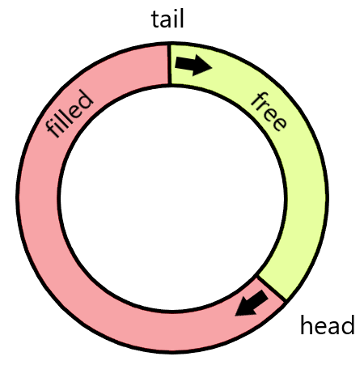

# FastQueue2

FastQueue2 is my rewrite of [FastQueue](https://github.com/andersc/fastqueue). It moves 8-byte values between one producer and one consumer.

## But first

* Is it memory efficient? No. I'm after speed, not minimum memory use.
* Is it “under-synchronized”? Please test that claim instead of guessing. `FastQueueIntegrityTest.cpp` is a starting point; add tests for your own workload too.
* Why no pointer specialization? The default queue moves any 8-byte value. A pointer is common, but it isn't required. Specializing pointers didn't help in my tests.

FastQueue2 is SPSC: **one producer, one consumer**. Neither side may have multiple threads calling into the same queue at once.

## Background

When I started benchmarking SPSC queues, [deaod’s](https://github.com/Deaod/spsc_queue) and [Dro’s](https://github.com/drogalis/SPSC-Queue/tree/main) were tough competition. [Rigtorp](https://github.com/rigtorp/SPSCQueue), [Folly](https://github.com/facebook/folly/tree/main), [moodycamel](https://github.com/cameron314/concurrentqueue), and [boost](https://www.boost.org/doc/libs/1_66_0/doc/html/lockfree.html) are worth knowing too. My earlier [FastQueue](https://github.com/andersc/fastqueue) was fast, but not best in every test. So I narrowed the job: 64-bit x86_64 and arm64 CPUs, one writer, one reader, and 8-byte messages.

A ring buffer wraps around when it reaches its end. Producer and consumer track where to write and read. If they run on different CPUs, keeping those positions in sync can cost more than moving a pointer.



*Diagram from Deaod’s repo.*

The first version of FastQueue2 tried a neat shortcut: use each pointer slot as both message and full/empty flag. Producer waited for `nullptr`; consumer cleared the slot after reading. It looked good when the benchmark allocated every message, because allocation hid queue costs. In a test of the queue alone, sending the same cache line back and forth for every item was expensive. I've kept the idea for the separate EPYC experiment below, where some CPU placements really do benefit. It is **not** how the default queue works.


The default `FastQueue` now uses **cached indices**. Each side keeps a local copy of the other side's position and checks the shared position when needed. Consumer doesn't clear a slot after reading it. Several pointers can pass through one cache line without sending it back just to say “empty.” Release/acquire operations make publication safe.

On x86, `-march=znver2` selects wrapped indices and a six-item consumer cushion, which won in our Zen2 measurements. Other x86 builds use monotonic indices and immediate drain, which worked better on tested Haswell. You can override `FQ_WRAPPED_INDICES` and `FQ_CONSUMER_CUSHION` to test another choice. ARM keeps its ring inside the queue by default (`FQ_ARM_RING_INLINE=1`); setting it to `0` tests separate storage. These are measured choices, not promises for every CPU.

## Usage

Copy `fast_queue_x86_64.h` or `fast_queue_arm64.h` into your project. The default API has `push`, `pop`, `tryPush`, `tryPop`, and `stopQueue`. Use one producer thread and one consumer thread. Want to move several pointers at once? See Bulk API below. The opt-in EPYC header has a narrower contract.


## The need for speed

I want a fast queue, but a big number isn't enough. Once I let a benchmark allocate and free every message, it mostly measured the allocator. Running one competitor first can also give it a cooler, faster CPU. Here's how the current pooled-pointer comparison tries to avoid that:

- Allocate pointers before timing, so we're measuring the queue.
- Start producer and consumer together; wait for both to finish.
- Transfer an exact count and check that every pointer arrives in order.
- Change competitor order each round and use the median of 12 rounds.
- On Linux, pin workers to physical cores; use the stated governor and real-time settings.

Numbers below are **millions of items per second**, not calls per second. Higher is better. Compare queues *within one row*: different machines aren't directly comparable.

| Machine | FastQueue | Deaod | Dro | David V5 |
| --- | ---: | ---: | ---: | ---: |
| Apple M5, macOS arm64 | **396.473M** | 165.428M | 77.379M | 154.271M |
| ARM Cortex-X925 + Cortex-A725, Linux arm64, X925 CPUs 5/6 | 83.678M | 86.346M | **87.382M** | 86.551M |
| AMD EPYC 7702, Zen2 dual socket, CPUs 1/3 | **123.935M** | 90.443M | 107.959M | 102.075M |
| AMD EPYC 7702P, Zen2, CPUs 1/3 | **118.629M** | 75.078M | 90.129M | 79.699M |
| Intel Xeon E5-2630L v3, Haswell, CPUs 1/3 | **117.951M** | 28.725M | 31.869M | 27.067M |

This table uses **default cached-index FastQueue**, not the experimental EPYC queue. macOS gives us scheduler affinity *hints*, not hard logical-CPU pinning. Linux rows use hard-pinned physical cores and `g++ -O3 -DNDEBUG -march=native`. These are results for these runs, not a universal league table.

Heap mode includes allocation cost; pooled mode better isolates the queue. [David V5](https://david.alvarezrosa.com/posts/optimizing-a-lock-free-ring-buffer/) comes from David Álvarez Rosa's ring-buffer analysis.

### Trying slot signaling on some CPUs

Remember that first version where `nullptr` meant an empty slot? I'm trying that idea again in `fast_queue_x86_64_epyc.h` as an **opt-in experiment**. Use it only if you can work within its rules: x86_64, one producer, one consumer, non-null pointers, scalar transfers, and a known number of messages. It has no `stopQueue()`; both sides must know when to finish. Default FastQueue2 and its bulk/topology benchmarks still use cached indices.

**Why try it?** Instead of checking shared head/tail positions, producer waits for an empty pointer slot and publishes a non-null pointer. Consumer reads it and clears the slot. Atomic release/acquire operations make the handoff safe. We spread successive logical slots across cache lines, using BMI1/BMI2 index instructions if the compiler enables them. This may help one CPU pairing and hurt another.

**What did we see?** On older Zen2 EPYC 7702P, with producer and consumer on different cores sharing an L3 cache, it ran **1.59–2.74×** faster than cached-index FastQueue2 at capacities 256–65,536. On SMT siblings (two threads on one core), cached indices won. Some small and cross-L3 cases also favored cached indices. Our slot version generally tracked upstream AtomicQueue closely. An earlier AtomicQueue comparison also covered EPYC 7702; the full slot-policy sweep was on 7702P. We have **no newer EPYC results**, and no reason to switch the default for everyone.

Want to check your machine? CMake has an opt-in `fast_queue2_epyc` target. This runner compares default FastQueue2, the slot experiment, and pinned AtomicQueue v1.9.2:

```bash
python3 tools/run_epyc_experiment.py \
  --capacities 64,256,1024,4096,65536 \
  --placements 0:64,0:1,0:4 \
  --transfers 50000000 --rounds 12 --assembly
```

The runner changes queue order each round, checks FIFO and CPU pinning, and saves CSV and machine details under `/tmp/fq-epyc-experiment` by default. Optional Linux `perf stat` helps investigate *why* one policy wins. Check that the requested CPU numbers mean what you think on your host.

## Bulk API

If you want to send multiple 8-byte messages at once, use the Bulk API. Instead of publishing each pointer separately, it can copy a group and publish the new position in one go. That's less handoff work when you already have a group ready. It still has one producer and one consumer; it is **not** the opt-in slot-signaling queue.

Here's how to send two pointers. With `Job` defined by your application and a shared `FastQueue<Job*, 1023, 64> queue`, run producer and consumer code in **different threads**. Each thread owns its own batch:

```cpp
// Producer thread:
FastQueueBatch<Job*> outgoing{};
outgoing.items[0] = first;
outgoing.items[1] = second;
std::size_t sent = 0;
while (sent < 2) {
    const auto moved = queue.tryPushBatch<2>(outgoing, sent);
    sent += moved;
    if (moved == 0) std::this_thread::yield(); // Full: let consumer run.
}

// Consumer thread (same queue, separate batch):
FastQueueBatch<Job*> incoming{};
std::size_t received = 0;
while (received < 2) {
    const auto moved = queue.tryPopBatch<2>(incoming, received);
    received += moved;
    if (moved == 0) std::this_thread::yield(); // Empty: let producer run.
}
// incoming.items[0] and [1] now hold the two messages.
```

Include `<thread>` for `std::this_thread::yield()`, or use your application's wait/backpressure policy. Each call is **nonblocking**: it may move two, one, or zero items. `sent` and `received` tell the next call where to continue. Don't overwrite an unsent item; don't read an unfilled receive slot. Producer and consumer can use different widths, and FIFO order also holds if you mix scalar and batch calls.

Width (`<2>` above) is a **compile-time** choice. On x86 and standard 64-byte ARM builds choose 1–8; Apple Silicon defaults to 128-byte batches so choose 1–16. `FastQueueBatch<T>` owns the slots (aligned to 64 or 128 bytes). Change `FQ_ARM_BATCH_BYTES` only after checking your target. There is no pointer-and-length bulk call: if input length changes at runtime, break it into chunks and choose a fixed width for each chunk as below.

**How does it work?** The queue checks available space or data, copies what fits, then publishes the updated index using release/acquire ordering. At the ring's end it splits the copy so it never reads past the buffer. x86 can use AVX2 (four pointers per vector) or AVX-512 (eight, only on supported builds); ARM uses NEON (two per vector). These instructions copy the messages; they don't replace synchronization. Wider isn't always faster: measure it.

### Callback with runtime item count

What if a callback gives you 23 pointers today and 2 tomorrow? Split them into chunks up to `FastQueueBatch<T*>::max_size`, then choose a fixed width with a `switch`. This helper waits until **each whole chunk** is sent, so it never loses a partially sent batch. It belongs in the producer thread; consumer needs its own batch and receive loop.

```cpp
#include <algorithm>
#include <cstddef>
#include <functional>
#include <thread>

// Wait must allow consumer to run: yield, an event-loop wait, or a semaphore.
// This helper is only for one producer context of this SPSC queue.
template <std::size_t N, class Queue, class T, class Wait>
void pushStaged(Queue& queue, const FastQueueBatch<T*>& batch, Wait&& wait) {
    std::size_t offset = 0;
    while (offset != N) {
        const std::size_t moved = queue.template tryPushBatch<N>(batch, offset);
        if (moved == 0) {
            std::invoke(wait);       // Full. batch must stay unchanged.
            continue;
        }
        offset += moved;             // Retry only unsent suffix.
    }
}

template <class Queue, class T, class Wait>
void pushCallbackPointers(Queue& queue, T* const* input,
                          std::size_t count, Wait&& wait) {
    using Batch = FastQueueBatch<T*>;
    static_assert(Batch::max_size == 8 || Batch::max_size == 16);

    while (count != 0) {
        const std::size_t width = std::min(count, Batch::max_size);
        Batch batch{};               // Caller-owned, producer-local staging.
        std::copy_n(input, width, batch.items);

        // Width is runtime data at callback boundary; each case is still a
        // compile-time-specialized queue operation.
        switch (width) {
        case 1: pushStaged<1>(queue, batch, wait); break;
        case 2: pushStaged<2>(queue, batch, wait); break;
        case 3: pushStaged<3>(queue, batch, wait); break;
        case 4: pushStaged<4>(queue, batch, wait); break;
        case 5: pushStaged<5>(queue, batch, wait); break;
        case 6: pushStaged<6>(queue, batch, wait); break;
        case 7: pushStaged<7>(queue, batch, wait); break;
        case 8: pushStaged<8>(queue, batch, wait); break;
        default:
            if constexpr (Batch::max_size == 16) {
                switch (width) {
                case 9:  pushStaged<9>(queue, batch, wait); break;
                case 10: pushStaged<10>(queue, batch, wait); break;
                case 11: pushStaged<11>(queue, batch, wait); break;
                case 12: pushStaged<12>(queue, batch, wait); break;
                case 13: pushStaged<13>(queue, batch, wait); break;
                case 14: pushStaged<14>(queue, batch, wait); break;
                case 15: pushStaged<15>(queue, batch, wait); break;
                case 16: pushStaged<16>(queue, batch, wait); break;
                }
            }
            break; // Unreachable: width <= Batch::max_size.
        }

        input += width;               // Advance only after whole chunk sent.
        count -= width;
    }
}
```

Example callback, with 23 pointers on any target:

```cpp
void onJobs(FastQueue<Job*, 1023, 64>& queue, Job* const* jobs,
            std::size_t jobCount) {
    pushCallbackPointers(queue, jobs, jobCount, [] {
        std::this_thread::yield();    // Replace with app wait/backpressure policy.
    });
}
```

For 23 pointers, x86/default ARM sends `8 + 8 + 7`; Apple ARM sends `16 + 7`. The same helper works for any count. Default FastQueue permits `nullptr` as a message: use the **count**, not a null terminator, to know when you're done. If a callback can't wait, return the number actually queued and keep the rest for later; don't drop unsent pointers.

### Why not scan for empty slots?

Default FastQueue already knows what's available from its cached indices. Looking for `nullptr` in payload slots would add reads and break valid null messages. Runtime-count loops and function-pointer dispatch didn't reliably beat fixed-width calls either: they can make it harder for the compiler to optimize the copy. Non-temporal stores don't suit data consumer will read right away. Those are measured choices, not a rule that another CPU can never do better.

Bulk benchmark numbers below are **items/s**, not calls/s. They compare widths of FastQueue2 only: Deaod, Dro, and David V5 don't have matching bulk APIs. Each run moves an exact count, checks FIFO, starts producer and consumer together, and reports median of 12 solo rounds.

### How I measured widths

Transfer count means pointer *items* per timed round, not queue capacity. Five million items gives a quick first look; 100 million is a longer check for likely winners. Results from different run lengths aren't interchangeable. If a sample is too short, scheduler noise and timer overhead can dominate; aim for roughly 100–500 ms or more per timed sample when choosing transfer count.

### Measured width sweep

| CPU / OS | Build / pinning | Scalar mode | Best fixed width | Best median | Gain vs scalar mode* |
|---|---|---:|---:|---:|---:|
| Apple M5, macOS arm64 | `-O3 -DNDEBUG -march=native`, scheduler affinity | 405.702 M/s | **14 pointers** | **971.983 M/s** | **+139.6%** |
| AMD EPYC 7702P (Zen2), Linux x86_64 | `-march=znver2`, CPUs 5/6 via `taskset` | 86.136 M/s | **2 pointers** | **216.641 M/s** | **+151.4%** |
| ARM Cortex-X925, Linux arm64 | `-march=native`, X925 CPUs 5/6, `taskset` | 84.209 M/s | **8 pointers** | **682.023 M/s** | **+709.9%** |
| AMD EPYC 7702, Zen2 dual socket, Linux x86_64 | `-march=native`, same-socket CPUs 1/3, `taskset` | 92.008 M/s | **8 pointers** | **176.237 M/s** | **+91.5%** |
| Intel Xeon E5-2630L v3, Haswell, Linux x86_64 | `-march=native`, same-socket CPUs 1/3, `taskset` | 35.098 M/s | **1 pointer** | **195.356 M/s** | **+456.6%** |
| AMD EPYC 7702P, Zen2, Linux x86_64 | `-march=native`, CPUs 1/3, `taskset` | 85.842 M/s | **2 pointers** | **212.092 M/s** | **+147.1%** |

\* **Scalar mode and fixed width 1 aren't the same test.** `BULK_BATCH_SIZE=0` uses scalar `tryPush`/`tryPop`; width 1 uses `tryPushBatch<1>`/`tryPopBatch<1>`. They each move one pointer, but the surrounding loops and generated code differ. Don't read the Haswell +456.6% entry as “batching one pointer is always that much faster.” It's a result for that exact setup; repeat matched tests before tuning your own Haswell machine.

M5 100M/12-round confirmation measured scalar `405.702 M/s`; fixed-14
`971.983 M/s` median (raw range `947.525–990.994 M/s`); fixed-16 screening
median was `915.786 M/s`. Fresh 5M/12-round medians were scalar mode
`404.961 M/s`, then fixed widths 1..16: `399.093`, `444.520`, `398.999`,
`479.157`, `487.387`, `506.235`, `598.372`, `810.849`, `818.386`, `865.688`,
`856.219`, `944.696`, `926.612`, `994.555`, `767.740`, and `915.786 M/s`.
Width 14 retained lead.

EPYC 7702P 100M/12-round confirmation measured scalar `86.136 M/s` and
fixed-2 `216.641 M/s`; fresh 5M sweep medians for widths 1..8 were `96.231`,
`219.491`, `201.201`, `109.358`, `105.974`, `137.958`, `134.691`, and
`184.613 M/s`. Fixed-2 retained lead. Wider batch does **not** guarantee more
throughput because
queue occupancy, retry patterns, compiler code shape, and cache/coherence traffic
can dominate payload copy work.

Linux hosts received fresh native 5M-transfer, 12-round pooled FastQueue-only
sweeps using existing CPU pairs, followed by fresh 100M/12-round scalar and
selected fixed-width confirmations. All selected pairs are separate physical
cores under `performance` governor: Cortex-X925 CPUs 5/6 are same X925 cluster;
dual-socket Zen2 CPUs 1/3 and Haswell CPUs 1/3 are same socket; single-socket
Zen2P CPUs 1/3 are local physical cores. Fresh 5M sweep medians in M items/s:

| Platform / CPU | Scalar API | Fixed 1 | Fixed 2 | Fixed 3 | Fixed 4 | Fixed 5 | Fixed 6 | Fixed 7 | Fixed 8 | Best fixed width |
|---|---:|---:|---:|---:|---:|---:|---:|---:|---:|---:|
| ARM Cortex-X925, Linux arm64 | 84.381 | 80.865 | 128.086 | 264.456 | 457.513 | 386.042 | 413.734 | 397.111 | **671.673** | 8 |
| AMD EPYC 7702, dual-socket Zen2, Linux x86_64 | 86.682 | 96.052 | **216.098** | 68.311 | 122.890 | 104.189 | 138.996 | 132.714 | 174.528 | 2 |
| Intel Xeon E5-2630L v3, Haswell, Linux x86_64 | 40.603 | **185.678** | 33.970 | 28.318 | 39.098 | 39.195 | 45.863 | 51.130 | 67.611 | 1 |
| AMD EPYC 7702P, Zen2, Linux x86_64 | 86.354 | 89.828 | **211.461** | 202.505 | 111.040 | 103.148 | 134.803 | 135.979 | 183.596 | 2 |

Values above are M items/s. Longer 100M-item checks gave Cortex-X925 width 8 `682.023`, Haswell width 1 `195.356`, and EPYC 7702P width 2 `212.092`. On dual-socket EPYC 7702, the short 5M-item run favored width 2; the longer 100M-item run favored width 8 (`176.237` vs `54.550` for width 2). That's why I don't pick a winner from a quick screening run alone.

### Reproduce before claims

```sh
# Apple M5: fixed batch widths 1..16; scalar API uses `BULK_BATCH_SIZE=0`.
clang++ -std=c++20 -O3 -DNDEBUG -march=native -pthread -I. -Ideaod_spsc -Idro \
  -DSOLO_QUEUE=4 -DPOOLED_ONLY=1 -DTRANSFER_COUNT=100000000ULL -DROUNDS=12 \
  -DBULK_BATCH_SIZE=14 main.cpp -o fastqueue-bulk14

# Zen2: fixed batch widths 1..8; scalar API uses `BULK_BATCH_SIZE=0`.
g++ -std=c++20 -O3 -DNDEBUG -march=znver2 -pthread -I. -Ideaod_spsc -Idro \
  -DSOLO_QUEUE=4 -DPOOLED_ONLY=1 -DTRANSFER_COUNT=100000000ULL -DROUNDS=12 \
  -DPRODUCER_CPU=5 -DCONSUMER_CPU=6 -DBULK_BATCH_SIZE=2 main.cpp -o fastqueue-bulk2
taskset -c 5,6 ./fastqueue-bulk2
```

`BULK_BATCH_SIZE=0` runs the scalar API. Valid fixed widths are 1–8 on x86 and standard ARM; 1–16 on default Apple Silicon. Only use `-mavx2` or `-mavx512f` on CPUs that support those instructions. SIMD speeds up copying pointers, not the queue's publication step. Measure widths on your own CPU before claiming a winner.


## Benchmark details

### Per-architecture tuning

Want to try the knobs yourself? The default ARM ring lives inside the queue (`FQ_ARM_RING_INLINE=1`), which was fastest in the measured Apple M5 pooled test. `FQ_ARM_RING_INLINE=0` tries a separate allocation. On x86, the compiler's `-march` setting picks a profile:

* `-march=znver2`: `FQ_WRAPPED_INDICES=1`, `FQ_CONSUMER_CUSHION=6`.
* Other x86 targets: `FQ_WRAPPED_INDICES=0`, `FQ_CONSUMER_CUSHION=0`.
* Define either macro before including the header if you want to test another setting.
* `FQ_OCCUPANCY_INSTRUMENT=1` records occupancy for diagnosis but changes throughput. Don't use it for headline numbers.

To reproduce a fixed-work Linux comparison (only change governor/real-time settings if you control the host):

```bash
g++ -O3 -DNDEBUG -std=c++20 -march=native -DPOOLED_ONLY=1 \
  -DTRANSFER_COUNT=100000000 -DROUNDS=12 -DCONSUMER_CPU=1 -DPRODUCER_CPU=3 \
  -I. -Ideaod_spsc -Idro main.cpp -o bench
sudo cpupower frequency-set -g performance
sudo chrt -f 90 ./bench
```

## Topology matrix: which CPUs talk fastest?

Where you run producer and consumer matters. Two threads on the same core (SMT siblings), two cores sharing cache, and two cores on different sockets can get very different speeds. Governor, other work on the host, and how full the queue gets also matter. One two-core result isn't a ranking of the whole machine.

Want to see the choices? `tools/run_topology_matrix.py` measures each allowed **producer → consumer** CPU pair, once with scalar API and again at every supported fixed batch width (1–8 on x86/common Linux ARM; up to 16 with Apple 128-byte batches). It skips producer == consumer: those are two distinct threads and a CPU can't be both placements for this test. Linux CSV rows record the CPU topology, whether workers were pinned, and individual rounds; summary JSON gives the median for each pair and mode.

The [interactive 3D topology explorer](https://andersc.github.io/fastqueue2/topology-matrix/) is the easiest way to look around. Pick a machine and a mode, hover for a measured rate, or click a producer → consumer path to compare widths. The axes show producer CPU, consumer CPU, and mode; color shows items per second. Each plotted cell represents one measured path and mode, not an average of neighboring CPUs. Raw timed rounds are in the CSV; per-path medians and host details are in JSON. Missing paths aren't filled in with made-up numbers.

Want a quick local probe instead of the full machine? This asks for four allowed CPUs and aims for at least 100 ms of work per path:

```bash
python3 tools/run_topology_matrix.py \
  --max-cpus 4 --transfers 720720 --min-sample-ms 100 \
  --rounds 5 --warmups 1
```

### Interactive topology explorer

[Open the FastQueue2 topology explorer](https://andersc.github.io/fastqueue2/topology-matrix/). Change system and width, orbit/zoom the 3D view, and inspect a path. You can choose a color scale for the selected mode or one shared across all modes. Filtering by same/cross NUMA node is useful on systems with more than one NUMA node; a single NUMA node can still have important cache-cluster boundaries. The viewer shows measured directed paths; the CSV remains the source for individual timed rounds.

### Completed full-span Linux results

| System | Coverage | Artifacts |
|---|---|---|
| AMD EPYC 7702 (dual socket) | All 256 logical CPUs across 2 NUMA nodes; scalar and widths 1–8. 12 timed rounds and 2 warmups per path/mode; 587,520 exact medians from 7,050,240 timed rows, no missing pairs. Hard pinning, performance governor, requested `SCHED_RR` priority 10. The 250 ms calibration **target was not enforced**: many samples were shorter, and this dataset is noisy. Treat individual path rankings with caution while a replacement is investigated. | [Raw CSV (gzip)](docs/topology-matrix/linux-runs/fq-topology-f131-20260719-182926/results.csv.gz) · [Medians](docs/topology-matrix/linux-runs/fq-topology-f131-20260719-182926/summary.json) · [Metadata](docs/topology-matrix/linux-runs/fq-topology-f131-20260719-182926/metadata.json) |
| Intel Xeon E5-2630L v3 | All 32 logical CPUs; scalar and widths 1–8. One uniform 12-round run with 2 warmups and 500 ms target, hard pinning, performance governor, `SCHED_RR` priority 10. | [Raw CSV](docs/topology-matrix/linux-runs/fq-topology-f061-20260727-215424/results.csv) · [Medians](docs/topology-matrix/linux-runs/fq-topology-f061-20260727-215424/summary.json) · [Metadata](docs/topology-matrix/linux-runs/fq-topology-f061-20260727-215424/metadata.json) |
| AMD EPYC 7702P | All 128 logical CPUs; scalar and widths 1–8. One uniform 12-round run with 2 warmups and 250 ms target, hard pinning. Host activity can affect close per-path rankings. | [Raw CSV](docs/topology-matrix/linux-runs/fq-topology-f177-20260727-213450/results.csv) · [Medians](docs/topology-matrix/linux-runs/fq-topology-f177-20260727-213450/summary.json) · [Metadata](docs/topology-matrix/linux-runs/fq-topology-f177-20260727-213450/metadata.json) |

Explorer exposes one canonical dataset per system. It renders each exact measured cell; no CPU values are averaged, inferred, or smoothed. Dataset provenance lives in linked metadata, not Explorer controls.

### How big is a matrix?

With 32 CPUs there are `32 × 31 = 992` directed paths: CPU 1 → CPU 2 and CPU 2 → CPU 1 count separately, and no CPU sends to itself. Scalar plus fixed widths 1–8 gives nine modes. That's `992 × 9 = 8,928` path/mode results. Five timed rounds write `8,928 × 5 = 44,640` CSV rows; twelve rounds write `107,136`. The published 32-CPU Xeon run uses **twelve**. Warmups run before timing but don't appear as CSV rows or affect the median.

More rounds help with brief interruptions, but also take longer: twelve cost 2.4 times as much as five. They can't remove IRQs, other software, frequency changes, or heat. An old calibration *target* wasn't a guarantee that every timed round lasted that long. That's what went wrong with the original f131 run: nearly half its timed rows fell below its 250 ms target. Don't read its fine-grained rankings as precise results.

Each archive includes raw rounds and information about the host. On Linux, we use the CPU's NUMA node to mark boundaries in the view. CPU IDs don't have to be consecutive. If NUMA information isn't available, physical package is labeled as a fallback; if neither is available, we don't claim a boundary. A machine can have one NUMA node and still have separate L3 cache clusters.

Full matrices can take days. For 128 selected CPUs and nine modes, there are `128 × 127 × 9 = 146,304` paths/modes. At five rounds plus one warmup, that's 877,824 runs. Start smaller: try SMT siblings, cores sharing cache, different cache clusters, then cross-NUMA paths.

If you have **identical, otherwise idle hosts**, you can split producer rows across them. Only combine CSVs when CPU selection, binary, settings, and topology match. Don't mix unrelated machines:

```bash
# Host 0 of 8
python3 tools/run_topology_matrix.py --max-cpus 128 --transfers 720720 \
  --min-sample-ms 100 --rounds 5 --warmups 1 \
  --producer-shards 8 --producer-shard 0 --out /tmp/fq-shard-0

# Host 1 uses --producer-shard 1; continue through 7.
# Progress stderr reports timed samples completed and rolling ETA.
cat /tmp/fq-shard-*/results.csv | { head -n 1; grep -hv '^producer_cpu,'; } > merged-results.csv
```

Use a transfer count divisible by every fixed width: `840` works for widths 1–8; `720720` works for widths 1–16.

### Running on Linux hosts

`tools/remote_topology.py` copies current source, builds it on each host, then starts a detached `nohup` job. It keeps running if SSH disconnects or your local computer reboots; it won't survive a reboot of the remote host. Each launch gets a new `/tmp/fq-topology-<host>-<timestamp>/` directory with logs, PID, settings, build, and results. **Don't reuse a run directory**: the benchmark truncates its CSV at startup. By default it tests scalar plus all supported fixed widths.

```bash
# Launch fresh full-width topology runs: scalar plus every target-supported fixed width.
python3 tools/remote_topology.py launch --hosts <configured-hosts> \
  --transfers 720720 --min-sample-ms 100 --rounds 5 --warmups 1 --plot-cpus 0

# Inspect remote PID, raw CSV row count, and latest progress/ETA without stopping jobs.
python3 tools/remote_topology.py status --hosts <configured-hosts>

# Copy only finished, fully rendered artifact sets into docs/topology-matrix/linux-runs/.
python3 tools/remote_topology.py harvest --hosts <configured-hosts>
```

Don't merge results from different CPU models or topologies. `launch.json` records host, source revision, launch time, and arguments. Harvest only finished runs; before publishing, check that every expected CPU pair, width, and round is present, workers really ran on requested CPUs, and all rates are valid. `--widths 0,8` makes a smaller probe; leaving widths out requests all supported modes.

The important files in each run are:

```text
results.csv      every timed producer → consumer sample
summary.json     median and sample count for each path and mode
metadata.json    machine and benchmark settings
```

Rendered images are optional presentation artifacts; use the interactive Explorer for navigation and raw CSV for exact rounds.

On Linux, the runner uses CPUs allowed by the OS/container, pins each worker with `pthread_setaffinity_np`, and records `pinned=1` when both calls succeed. CPU numbers can have gaps. Socket, core, and SMT information comes from Linux rather than guessed CPU numbers. macOS has only affinity hints, not hard logical-CPU pinning; don't mistake its placement results for exact core-to-core paths. x86_64 and arm64 CPU models can use the current backends; a new instruction-set architecture would need a new backend and tests.

An older four-CPU EPYC 7702 smoke probe tested basic operation, not reliable pair-by-pair performance: some fixed-width samples lasted only milliseconds. For measured paths use the [FastQueue2 topology explorer](https://andersc.github.io/fastqueue2/topology-matrix/) and the raw CSV/JSON links in the system table above, keeping its f131 noise warning in mind.

## Build and run the tests

Want to check the queue on your own CPU?

```bash
git clone https://github.com/andersc/fastqueue2.git
cd fastqueue2
cmake -S . -B build -DCMAKE_BUILD_TYPE=Release
cmake --build build
ctest --test-dir build --output-on-failure
./build/fast_queue2               # scalar comparison with Deaod, Dro, David V5
./build/fast_queue_integrity_test # FIFO and data checks
```

These run the default queue. The EPYC experiment is opt-in, not part of this ordinary build.


## Some thoughts

A few things surprised me while measuring:

1. **Moving two counters farther apart helped.** On tested x86 CPUs, separating the hot read and write indices by 128 bytes was about 18% faster than 64 bytes on AMD Zen. One likely reason is that the CPU fetches neighboring cache lines together. On tested ARM machines, 256-byte separation worked best. The headers use different alignments for that reason; don't assume these distances win on every CPU.
2. **Where the ARM ring lives matters.** On Apple M5, putting the ring inside the queue was fastest in the pooled test. That's the default (`FQ_ARM_RING_INLINE=1`); `0` tries separate allocation.
3. **An atomic operation for every item isn't free.** On Apple Silicon, making every slot atomic with acquire/release was about 2.6× slower in that experiment than publishing through an index. That's why the default ARM queue doesn't copy the EPYC slot approach.
4. **Benchmarks can fool us.** Allocation, competitor order, machine load, and heat change the result. We rotate order and report medians, but it's still a microbenchmark. On macOS, an affinity tag doesn't pin a thread to a specific CPU; on Linux, pinning, a performance governor, and `chrt` can improve repeatability but can't make other work disappear. These controls affect the measurement, not queue correctness.

Please compare queues within the same benchmark row, then measure your own workload. Can this be beaten? Probably. I'd rather find out than declare a universal winner.

